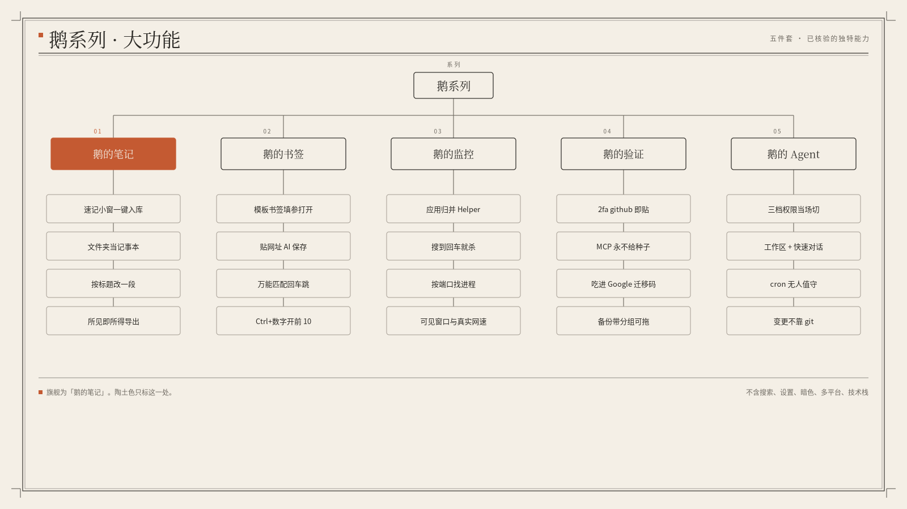

> **已迁入 [Goose Hub](https://github.com/eachann1024/goose-hub)。** 本仓库不再提供云同步。本地数据在 `~/.config/marks`。云端代码（`server/`、`worker/`）已备份到本机 `~/Work/archive/goose-marks-cloud/`。需要 uTools 时代快照时，用 tag `utools-last` 回滚。

# 鹅的书签

在主框贴网址就能入库。带 `{占位符}` 的书签能当搜索引擎，不是再做一棵浏览器书签树。

## 视频介绍

[观看／下载 MP4](https://github.com/eachann1024/goose-mark/raw/refs/heads/main/docs/media/product-intro-zh.mp4) · 中文旁白 · 1080p · 42 秒

**6.7.0源码界面演示·虚构数据**。展示两级分组、多位置归属、中文与拼音搜索、布局切换、虚构书签删除还原及实际 JSON 导出。基于 `6e987f8529f6c1f13e72808fd120d14a31a3e034`；本片未验证 uTools 持久化、AI 或云同步。

## 大功能

- **模板书签**：URL 里写 `{query}` / `{关键词}`，在 uTools 按 Tab 填参打开。
- **贴网址就保存**：主框贴 http(s)，读网页、润色标题简介并归组。侧栏聊天式 AI 已经拿掉。
- **万能匹配**：书签可进主输入框；本地搜不到时，回车用当前词跳转。
- **图标落盘与死链**：图标写进本机文件，失败用首字母色块；无效地址本机探测。
- **Ctrl+数字**：按住 Ctrl，当前前 10 个书签出数字，1–9 / 0 直接打开。

## 系列

## 同系列

- [鹅的笔记](https://github.com/eachann1024/goose-notes)
- [鹅的书签](https://github.com/eachann1024/goose-mark)
- [鹅的监控](https://github.com/eachann1024/goose-monitor)
- [鹅的验证](https://github.com/eachann1024/goose-2fa)
- [鹅的 Agent](https://github.com/eachann1024/eachann1024)

## 不做什么

不把书签同步到某家云收藏夹。检测、图标、导入导出都走本机。

开发说明见 [DEVELOP.md](DEVELOP.md)。

## 许可

本项目以 [MIT 许可证](LICENSE) 开源，版权所有 © 2026 eachann1024。
